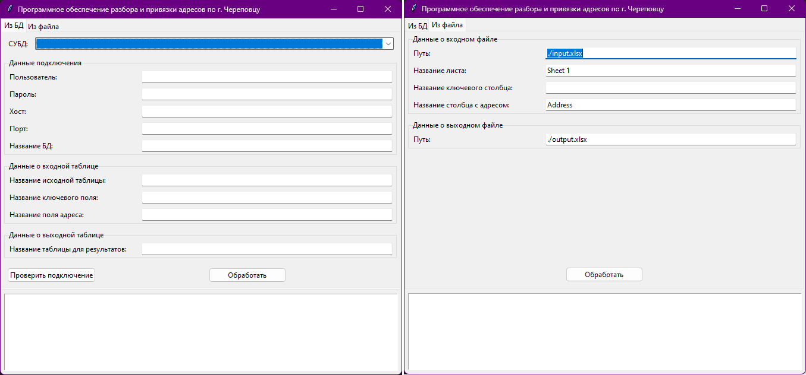
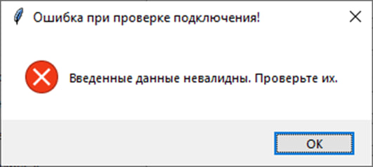
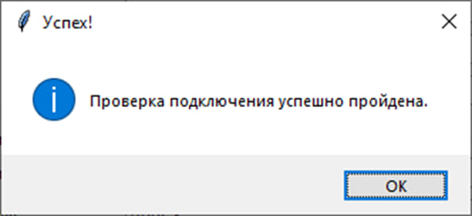
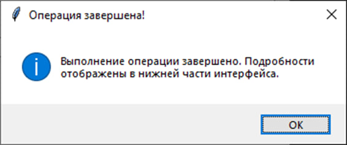
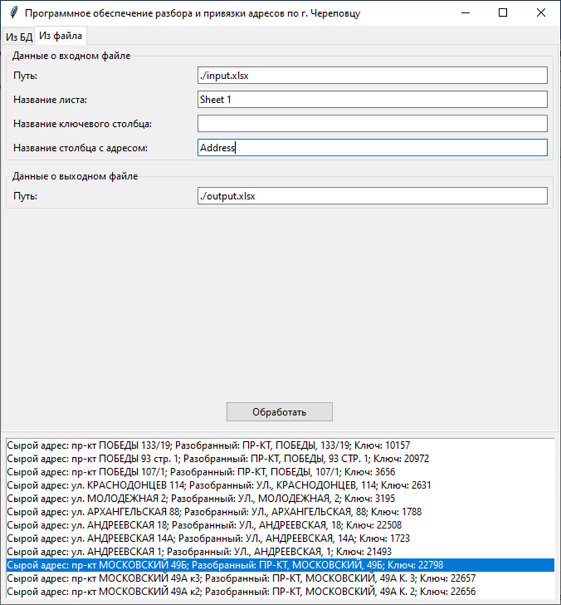

# Инструкция по установке и использованию

К письму приложен архив исходным кодом программы, а также данная инструкция для
использования. В случае возникновения ошибок, или вопросов писать на почту отправителя.


## Подготовка и установка

Данные шаги необходимо выполнять один раз при первом использовании.

1. Перед дальнейшими действиями необходимо убедиться, что на компьютере установлен
    python **3.10.*** (* значит любая минорая версия, например 3.10.1). При использовании другой версии работоспособность не гарантируется.
2. Распаковать содержимое архива в удобное место.
3. Запустить файл **INSTALL_REQUIERMENTS.bat** - он загрузит и установит все необходимые
    библиотеки для работы программы ( _требуется подключение к сети Интернет_ ). Не стоит
    беспокоится о том, что скачанные зависимости останутся в системе - они устанавливаются
    в виртуальное окружение (по окончанию установки в корне папки программы появится
    папка **venv** - содержит виртуальное окружение с зависимостями).

После выполнения шагов структура папки программы будет выглядеть следующим образом:

```
|___src/...
|
|___venv/... # Виртуальное окружение.
|
|___DB_EXPORT.xlsx # Файл с выгрузкой из БД.
|
|___INSTALL_REQUIERMENTS.bat # Батник для установки зависимостей.
|
|___CONSOLE.bat # Батник для запуска консольной утилиты.
|
|___GUI.bat # Батник для запуска графической оболочки.
|
|___main.py
|
|___requierments.txt
|
|___...
```

P.S. В случае, если Вы переместили папку с программой, необходимо удалить папку **venv** и
выполнить предыдущие шаги заново.


## Удаление

Для полного удаления программы с вашего компьютера необходимо удалить папку, в которой она содержится.
Программа не оставляет никаких файлов и изменений в системе за пределами данной папки.


## Возможности

Данное программное обеспечение позволяет преобразовывать почтовый адрес по г. Череповцу из "сырого" вида в структурированный, вида:
1. Название адресообразующего элемента;
2. Тип адресообразующего элемента;
3. Номер дома и его расширения (корпус, строение) 
4. Номер квартиры.

Также для разобранного адреса находится идентификатор из excel-файла.
Программа расчитана на работу с исходными данными в excel-файлах, а также с следующими СУБД:
1. PostgreSQL;
2. Oracle;
3. Microsoft SQL Server.

**На данный момент работа с  Oracle И Microsoft SQL Server не протестирована!!!**

При обработке данных из СУБД необходимо убедиться, что у пользователя имеются права на создание новой таблицы - в нее будут записаны результаты.
При обработке данных из excel-файла необходимо убедиться, что у пользователя имеются права на создание нового файла - в него будут записаны результаты.


## Требования к файлу выгрузки БД с идентификаторами адресов

Перед использованием необходимо удостовериться что выполнены следующие условия:

1. Файл с ключами и диапазонами квартир называется **DB_EXPORT.xlsx** (либо вы передаете свой путь к файлу в качестве аргумента при запуске) и содержит лист под именем **Sheet 1** (либо вы передаете свое название в качестве аргумента при запуске), на котором находятся все столбцы удволетворяющие условиям:
        i. Type - тип улицы в виде сокращения.
        ii. Name - название улицы.
        iii. House - номер дома.
        iv. Flat_start - первая квартира в доме.
        v. Flat_end - последняя квартира в доме.
        vi. Key - ключ.
        vii. Все записи в строках находятся в ВЕРХНЕМ регистре.


## Использование

Программа разработана для использования в двух режимах: 
1. Консольная утилита;
2. Приложение с графическим интерфейсом.


### Консольная утилита

Для использования ПО в данном режиме предварительно необходимо активировать виртуальное окружение (находясь в корне папки с программой):
```batch
call ./venv/Scripts/Activate.bat
```

Далее необходимо совершить запуск самой утилиты:
```batch
start python main.py
```

После завершения работы программы необходимо деактивировать виртуальное окружение:
```batch
call deactivate
```


#### Особенности:
1. Для запуска без дополнительного окна консоли замените 'python' на 'pythonw'.


#### Аргументы, передаваемые утилите:

| №   | Полное название параметра   | Короткое название | По умолчанию     | Описание                                                                                                                                                        |
| --- | --------------------------- | ----------------- | ---------------- | --------------------------------------------------------------------------------------------------------------------------------------------------------------- |
| 1   | --identity_column_name      | -id_name          | Отсутствует      | Название ключевого столбца во входных данных. Если не указан, то будет обработан лишь столбец с адресами. Можно использовать как с excel-файлами, так и с СУБД. |
| 2   | --gui                       | -g                | Ложь             | Запуск программы с графической оболочкой. При использовании данного флага остальные аргументы, кроме _(3, 4)_ игнорируются.                                     |
| 3   | --db_export_file            | -db_file          | ./DB_EXPORT.xlsx | Путь к excel-файлу выгрузки из БД. Возможно указывать путь, относительно данной папки.                                                                          |
| 4   | --db_export_sheet_name      | -db_sheet_name    | ./DB_EXPORT.xlsx | Название листа в файле выгрузки из БД.                                                                                                                          |
| 5   | --verbose                   | -v                | Ложь             | Необходимо ли выводить информацию о ходе работы в консоль.                                                                                                      |
| 6   | --input_file                | -i                | ./input.xlsx     | Путь к excel-файлу с входными данными. Возможно указывать путь, относительно данной папки.                                                                      |
| 7   | --input_sheet_name          | -isn              | Sheet 1          | Название листа в excel-файле с входными данными.                                                                                                                |
| 8   | --input_column_name         | -icn              | Address          | Название столбца с сырыми адресами в excel-файле с входными данными.                                                                                            |
| 9   | --output_file               | -o                | ./output.xlsx    | Путь к excel-файлу с выходными данными. Возможно указывать путь, относительно данной папки.                                                                     |
| 10  | --database_managment_system | -dbms             | Отсутствует      | Желаемая СУБД. Варианты: 'postgres', 'oracle', 'ms-sql-server'.                                                                                                 |
| 11  | --host                      | -host             | Отсутствует      | Хост, на котором запущена СУБД.                                                                                                                                 |
| 12  | --port                      | -p                | Отсутствует      | Порт для подключения к СУБД.                                                                                                                                    |
| 13  | --database                  | -db               | Отсутствует      | Название базы данных.                                                                                                                                           |
| 14  | --user                      | -u                | Отсутствует      | Имя пользователя.                                                                                                                                               |
| 15  | --password                  | -pwd              | Отсутствует      | Пароль.                                                                                                                                                         |


### Графисеская оболочка

Графическая оболочка представлена на рисунке ниже.



В нижней части интерфейса будет отображатся ход работы программы.


#### Режим работы с СУБД

Для режима работы программы «Из БД» производится выбор СУБД из выпадающего списка, затем заполнение данных подключения к БД: 
1. Имени пользователя;
2. Пароля пользователя;
3. Хоста;
4. Порта;
5. Названия БД. 

Также необходимо заполнить данные о таблице, из которой будут браться адреса для обработки:
1. Название исходной таблицы;
2. Название ключевого поля (не является обязательным);
3. Название поля адреса;
4. Название таблицы для результатов.

Перед нажатем кнопки "Обработать" настоятельно рекомендуем воспользоваться возможностью проверки подключения.
В случае если при нажатии на кнопку «Проверить подключение» какие-либо поля останутся не заполнены или введенные данные окажутся некорректными и не будут совпадать с данными БД, всплывет уведомляющее об этом окно: 



Если же данные подключения введены корректно при проверке подключения всплывет окно:



После выполнения обработки всплывет окно уведомляющее об успешном завершении операции обработки.



Обработанные адреса попадут в сформированный выходной файл/таблицу и также будут представлены в нижней части интерфейса окна программы:




#### Режим работы с excel-файлами

Для режима работы программы «Из файла» производится заполнение данных о входном файле: 
1. Путь к входному файлу (может являться относительным);
2. Название листа;
3. Название ключевого столбца (не является обязательным);
4. Название столбца с адресом;
5. Путь к выходному файлу (может являться относительным). 


Структура результата:
1. "Сырой" адрес;
2. Название адресообразующего элемента;
3. Тип адресообразующего элемента;
4. Дом и его расширения;
5. Квартира (если была указана);
6. Ключ (если был найден);
7. Идентификатор из исходной таблице (если использовался).


## Примечания

Для удобства использования рекомендуем воспользоваться подготовленными bat-файлами, которые находятся в корне папки с программой:
1. INSTALL_REQUIERMENTS.bat - производит установку всех зависимостей и библиотек для работы ПО. В случае, если вам необходимо установить их вручную, вы всегда можете это сделать, ведь список всех зависимостей хранится в файле _requierments.txt_.
2. GUI.bat - Запуск приложения с графической оболочкой.
3. CONSOLE.bat - Запуск консольного режима. По умолчанию входной и выходной файлы - input.xlsx и output.xlsx, находящиеся в корне папки программы. Активен вывод работы программы в коносль.


## Отправка заявок об ошибках и неточностях

Программное обеспечение записывает логи в папку _logs_, находящуюся в корне папки программы.
К заявке необходимо предоставить содержимое данной папки, а также скриншот последнего состояния программы.
Обращаться с заявкой к отправителю.